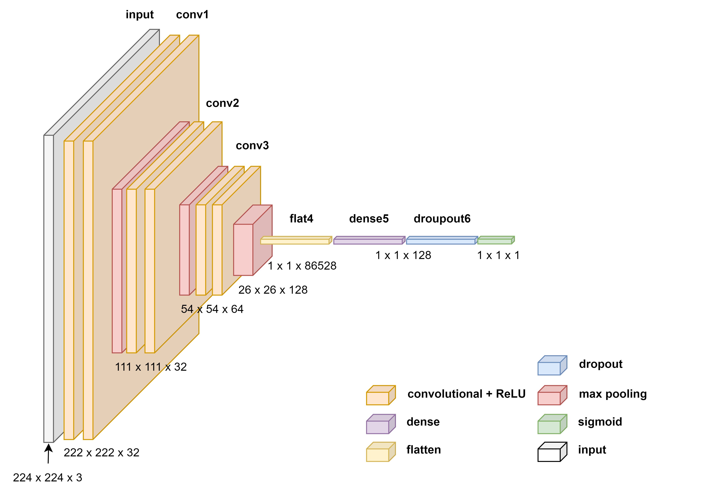

# Deep Learning Project
## Implementation and extended Replication: Unbiased Look at Dataset Bias

## Data

The 3 datasets used in this analysis are [Caltech-101](https://data.caltech.edu/records/mzrjq-6wc02), [MSRCorid](https://www.microsoft.com/en-us/download/details.aspx?id=52644), and [Pascal VOC-2007](https://datasets.activeloop.ai/docs/ml/datasets/pascal-voc-2007-dataset/#:~:text=Pascal%20VOC%202007%20Data%20Splits&text=Altogether%20the%20dataset%20set%20has,validation%20and%2050%25%20for%20testing).  
The task is **car classification**, so images containing a car are labeled 1, non-car images labeled 0.

## Research Interests

* literature review on the topic of dataset bias
* Replication and extension of the results of [Torralba and Efros (2011)](https://ieeexplore.ieee.org/abstract/document/5995347)
  - SVM Approach
  - CNN Approach

#### Folder structure explanation and dictionary
* `modeling_[]_cnn.py`: Script that preprocesses datset and creates CNN model
* `data loader.ipynb`: Script that creates the datasets
* `plots`: Folder containing plots
* `depreciated`: Folder containing previously used code or other attempts
